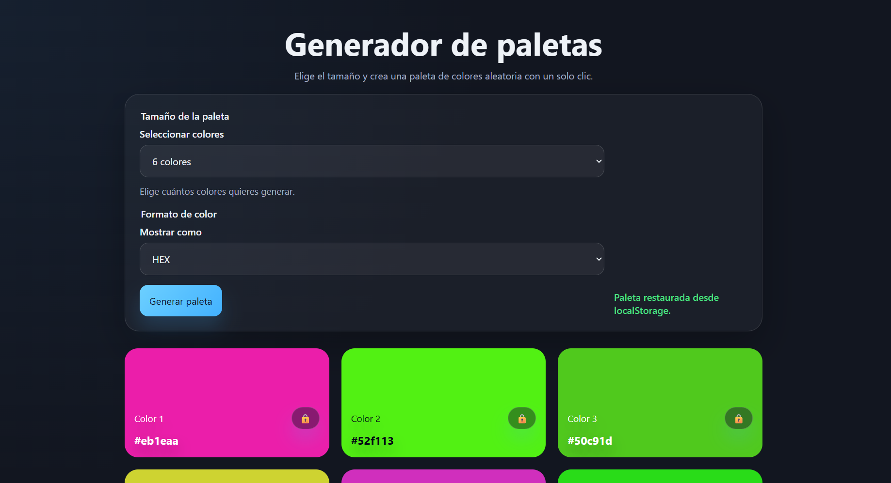

# 🎨 Generador de Paletas de Colores

Una aplicación web simple e interactiva que permite generar paletas de colores aleatorias con un solo clic.

## 🚀 Características

* 🎲 Generación aleatoria de colores
* 🎚️ Selección de cantidad de colores (6, 8 o 9)
* 🎨 Soporte de formatos:

  * HEX
  * HSL

* 🔒 Bloqueo de colores para mantenerlos al regenerar la paleta
* 📋 Copiado automático al hacer clic en un color
* 💾 Persistencia con `localStorage` (guarda tu última paleta)
* 📱 Diseño responsive (adaptado a distintos dispositivos)

## 🖥️ Demo

> Podés agregar acá el link cuando lo subas a GitHub Pages o similar

* **index.html** → Estructura de la web
* **styles.css** → estilos y diseño visual
* **script.js** → lógica de generación de colores e interacción

## ⚙️ Cómo funciona

La Web genera colores usando el modelo HSL:

* Se genera un tono (`hue`) aleatorio entre 0 y 360
* Se ajusta la saturación y luminosidad para obtener colores agradables
* Luego se convierte a formato HEX si es necesario

También:

* Guarda el estado en `localStorage`
* Permite bloquear colores individuales
* Calcula automáticamente el contraste para el texto

## 🧪 Uso

1. Seleccioná la cantidad de colores
2. Elegí el formato (HEX o HSL)
3. Hacé clic en **"Generar paleta"**
4. Hacé clic en un color para copiarlo
5. Usá el 🔒 para fijar colores

## 🛠️ Tecnologías utilizadas

* HTML5
* CSS3
* JavaScript (Vanilla)

## 📸 Captura

> 
